# Project Board  
En esta práctica se ha creado un project board a nivel de organización.  
Los projects boards a nivel de organización se crean en la parte de "Projects" de una organización. En esta zona, se pueden crear y ver todos los proyectos que se han creado en la organización por parte de sus intregantes. Y además se pueden añadir issues de todos los repositorios que peretenezcan a la organización.  
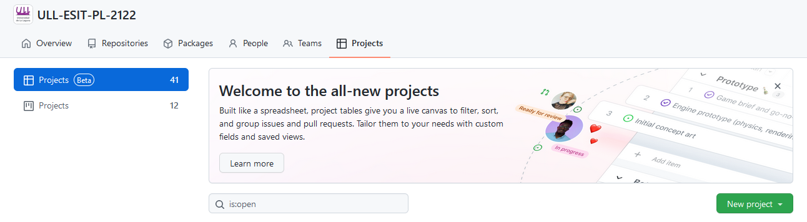

En nuestro caso, se va a crear un Kanbas Board a nivel de organización, a la que tendran acceso también los profesores, en la que se organizarán las prácticas a lo largo del curso.

## Crear la tabla.  
Para crear, vamos al lugar ya mencionado, (Projects de nuestra organización) y clicamos en nuevo proyecto.  
Aparecerán 2 opciones. Se elige la de "New project (Beta)", ya que queremos controlar varios repositorios.  
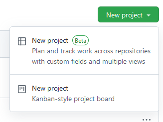  

Al clicar, se crea un nuevo repositorio con nombre nuestro nick y "untitled project". Se le cambia el nombre a "nuestro-nombre-aluxxx".  
En este caso "alejandro_garcia_perdomo_alu0101312101".  
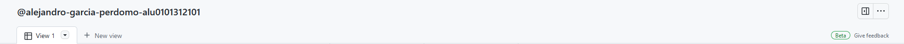  

## Controlar los accesos
Antes de crear entradas para nuestro proyecto, en este caso no nos interesa que otras personas de la organización entren a nuestro proyecto. Para evitarlo, entramos en las opciones de nuestro proyecto.  
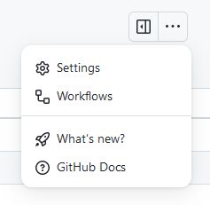  
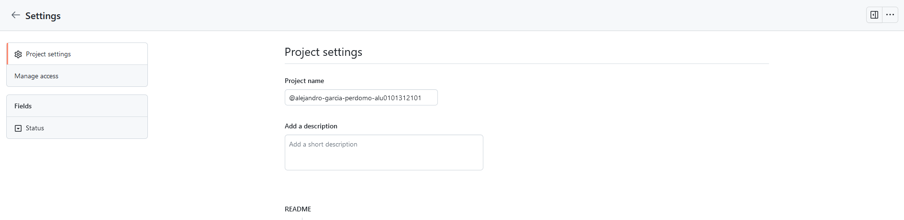  

En la segunda imagene de las dos anteriores, podemos ver la pantalla de ajustes de nuestro proyecto, donde podemos cambiar el nombre de nuevo, así como añadir una descripción o un README.md.  
Para modificar los permisos entramos en Manage access (Parte izquierda de la pantalla)  
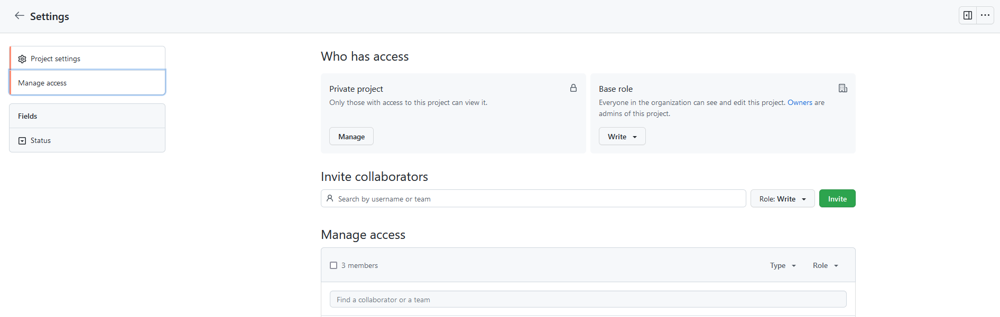  

Originalmente tenemos el proyecto como privado, asi como el rol básico de los miembros de nuestra organización como escritura, por lo que pueden modificar lo que tenemos.  
En "Base role" modificamos de "Write" a "No access":  
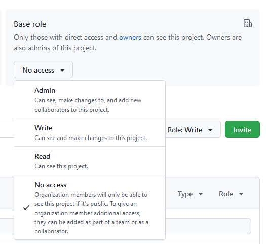  
Ahora personas de nuestra organización no pueden ver lo que estamos haciendo, pero si queremos añadir a otras personas podemos utilizar el apartado de "Invite collaborators". Se escribe el nombre o el nick de Guthub de la persona que queremos añadir y el rol, y se invita, en este caso añado a los profesores de la asignatura como administrador.  
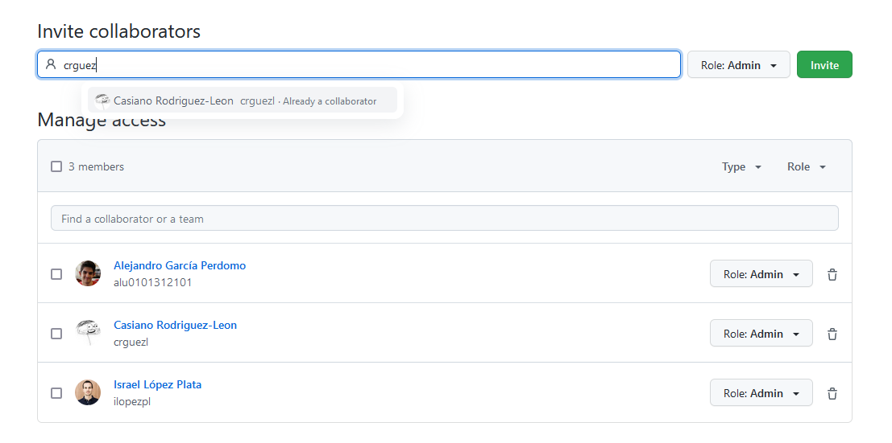  

## Añadir tareas, issues, etc.
Salimos de Settings y ahora queremos añadir nuestras tareas. Para ello debemos de clicar en el "+" que está en las filas.  
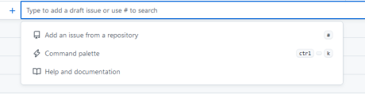  
Se nos darán varias opciones, o simplemente poner un nombre a este nuevo item de nuestro proyecto.  
Si elegimos la opción de añadir un issue desde repositorio, podremos elegir un issue ya creado en algún repositorio del que tengamos acceso en la organización. Automáticamente estarán todos sus datos en nuestro proyecto.
Si por otro lado creamos un item solo con el nombre, no tendrá ningun repositorio relacionado. Para ello debemos de añadir uno en el campo de "Repository". Si no aparece, debemos de clicar el "+" de las columnas.  
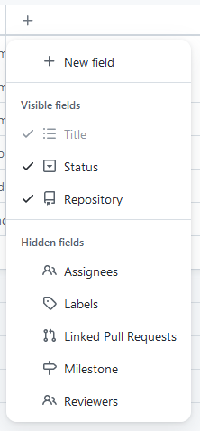  
Se podrán seleccionar distintos campos para mostrar de nuestros items. Para esta ocasión tendremos seleccionados como la imagen.
Si tenemos el campo de Repository, podremos añadir nuestro item al repositorio que queramos, creando así un nuevo issue dentro de ese repositorio.

## Vistas.
Se pueden crear varias vistas, con distintos campos y organizaciones. Por ejemplo, se puede ver como una tabla o por columnas como To Do, In Progress, Done, etc.  
Se pueden organizar en distintos grupos, asi como ordenar los grupos, etc.
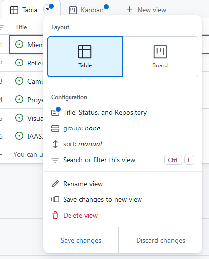  
Ejemplo de tabla:
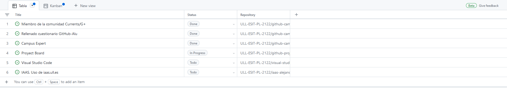  
Ejemplo de columnas:
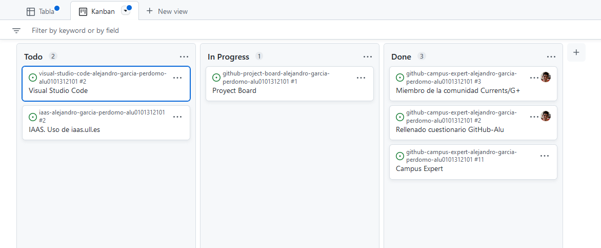  

